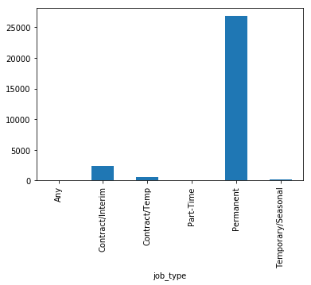

**Healthcare Job Title LDA**

This data was taken from eMedCareers. eMedCareers is a job search platform for pharmaceutical, biotechnology or healthcare jobs. This dataset contains 30000 latest job postings in Europe from eMedCareers job portal.

Is it possible to use LDA to understand

First, we will explore the CSV file to determine what type of data we can use for the analysis and how it is structured.


```python
# Importing modules
import pandas as pd
# Read datasets/papers.csv into papers
jobs = pd.read_csv(r'Desktop\Public GIT\emed_careers_eu.csv')

# Print out the first rows of papers
jobs.head()
```


<div>
<style>
    .dataframe thead tr:only-child th {
        text-align: right;
    }

    .dataframe thead th {
        text-align: left;
    }

    .dataframe tbody tr th {
        vertical-align: top;
    }
</style>
<table border="1" class="dataframe">
  <thead>
    <tr style="text-align: right;">
      <th></th>
      <th>category</th>
      <th>company_name</th>
      <th>job_description</th>
      <th>job_title</th>
      <th>job_type</th>
      <th>location</th>
      <th>post_date</th>
      <th>salary_offered</th>
    </tr>
  </thead>
  <tbody>
    <tr>
      <th>0</th>
      <td>Clinical Research</td>
      <td>PPD GLOBAL LTD</td>
      <td>As part of our on-going growth, we are current...</td>
      <td>Senior / Medical Writer (Regulatory)</td>
      <td>Permanent</td>
      <td>Cambridge</td>
      <td>4/14/2018</td>
      <td>Competitive</td>
    </tr>
    <tr>
      <th>1</th>
      <td>Science</td>
      <td>AL Solutions</td>
      <td>Manager of Biometrics – Italy\nAL Solutions ar...</td>
      <td>Manager of Biometrics</td>
      <td>Permanent</td>
      <td>Europe</td>
      <td>4/16/2018</td>
      <td>NaN</td>
    </tr>
    <tr>
      <th>2</th>
      <td>Science</td>
      <td>Seltek Consultants Ltd</td>
      <td>A fantastic opportunity has arisen for an expe...</td>
      <td>Field Service Engineer | Chromatography</td>
      <td>Permanent</td>
      <td>UK</td>
      <td>4/16/2018</td>
      <td>NaN</td>
    </tr>
    <tr>
      <th>3</th>
      <td>Data Management and Statistics</td>
      <td>Docs International UK Limited</td>
      <td>Job Details\n:\nUtilise extensive clinical dat...</td>
      <td>Data Manager of Project Management</td>
      <td>Permanent</td>
      <td>M4 Corridor</td>
      <td>4/11/2018</td>
      <td>On Application</td>
    </tr>
    <tr>
      <th>4</th>
      <td>Science</td>
      <td>Hyper Recruitment Solutions Ltd</td>
      <td>Hyper Recruitment Solutions are currently look...</td>
      <td>Strategic Market Analyst</td>
      <td>Permanent</td>
      <td>Cambridge</td>
      <td>4/13/2018</td>
      <td>NaN</td>
    </tr>
  </tbody>
</table>
</div>


```python
# Remove the columns
jobs = jobs.drop(['salary_offered'], axis=1)

# Print out the first rows of papers
jobs.head()
```


<div>
<style>
    .dataframe thead tr:only-child th {
        text-align: right;
    }

    .dataframe thead th {
        text-align: left;
    }

    .dataframe tbody tr th {
        vertical-align: top;
    }
</style>
<table border="1" class="dataframe">
  <thead>
    <tr style="text-align: right;">
      <th></th>
      <th>category</th>
      <th>company_name</th>
      <th>job_description</th>
      <th>job_title</th>
      <th>job_type</th>
      <th>location</th>
      <th>post_date</th>
    </tr>
  </thead>
  <tbody>
    <tr>
      <th>0</th>
      <td>Clinical Research</td>
      <td>PPD GLOBAL LTD</td>
      <td>As part of our on-going growth, we are current...</td>
      <td>Senior / Medical Writer (Regulatory)</td>
      <td>Permanent</td>
      <td>Cambridge</td>
      <td>4/14/2018</td>
    </tr>
    <tr>
      <th>1</th>
      <td>Science</td>
      <td>AL Solutions</td>
      <td>Manager of Biometrics – Italy\nAL Solutions ar...</td>
      <td>Manager of Biometrics</td>
      <td>Permanent</td>
      <td>Europe</td>
      <td>4/16/2018</td>
    </tr>
    <tr>
      <th>2</th>
      <td>Science</td>
      <td>Seltek Consultants Ltd</td>
      <td>A fantastic opportunity has arisen for an expe...</td>
      <td>Field Service Engineer | Chromatography</td>
      <td>Permanent</td>
      <td>UK</td>
      <td>4/16/2018</td>
    </tr>
    <tr>
      <th>3</th>
      <td>Data Management and Statistics</td>
      <td>Docs International UK Limited</td>
      <td>Job Details\n:\nUtilise extensive clinical dat...</td>
      <td>Data Manager of Project Management</td>
      <td>Permanent</td>
      <td>M4 Corridor</td>
      <td>4/11/2018</td>
    </tr>
    <tr>
      <th>4</th>
      <td>Science</td>
      <td>Hyper Recruitment Solutions Ltd</td>
      <td>Hyper Recruitment Solutions are currently look...</td>
      <td>Strategic Market Analyst</td>
      <td>Permanent</td>
      <td>Cambridge</td>
      <td>4/13/2018</td>
    </tr>
  </tbody>
</table>
</div>


In order to understand how the job landscape is changing in the healthcare field we will begin by visualizing the number of each category and some information on the job type. 


```python
# Group the jobs by category
CategoryGroups = jobs.groupby('category')
# Determine the size of each group
CategoryCounts = CategoryGroups.size()
# Visualise the counts as a bar plot
import matplotlib.pyplot as plt
%matplotlib inline
CategoryCounts.plot(kind='bar')
```


    <matplotlib.axes._subplots.AxesSubplot at 0x2e5c1227a58>


```python
# Group the jobs by type
TypeGroups = jobs.groupby('job_type')
# Determine the size of each group
TypeCounts = TypeGroups.size()
# Visualise the counts as a bar plot
import matplotlib.pyplot as plt
%matplotlib inline
TypeCounts.plot(kind='bar')
```


    <matplotlib.axes._subplots.AxesSubplot at 0x2e5c130a668>





Now we are ready to start looking more into the job titles. First, we will perform some simple preprocessing on the titles in order to make them more amenable for analysis. We will use a regular expression to remove any punctuation in the title. Then we will perform lowercasing. We'll then print the titles of the first rows before and after applying the modification.


```python
# Load the regular expression library
import re

# Print the titles of the first rows 
print(jobs['job_title'].head())

# Remove punctuation
jobs['title_processed'] = jobs['job_title'].map(lambda x: re.sub('[,\.!?]', '', str(x)))

# Convert the titles to lowercase
jobs['title_processed'] = jobs.apply(lambda row: row['title_processed'].lower(), axis=1)

# Drop Null
jobs = jobs.dropna()
# Print the processed titles of the first rows 
jobs.head()
```

    0       Senior / Medical Writer (Regulatory)
    1                     Manager of Biometrics 
    2    Field Service Engineer | Chromatography
    3         Data Manager of Project Management
    4                   Strategic Market Analyst
    Name: job_title, dtype: object
    


<div>
<style>
    .dataframe thead tr:only-child th {
        text-align: right;
    }

    .dataframe thead th {
        text-align: left;
    }

    .dataframe tbody tr th {
        vertical-align: top;
    }
</style>
<table border="1" class="dataframe">
  <thead>
    <tr style="text-align: right;">
      <th></th>
      <th>category</th>
      <th>company_name</th>
      <th>job_description</th>
      <th>job_title</th>
      <th>job_type</th>
      <th>location</th>
      <th>post_date</th>
      <th>title_processed</th>
    </tr>
  </thead>
  <tbody>
    <tr>
      <th>0</th>
      <td>Clinical Research</td>
      <td>PPD GLOBAL LTD</td>
      <td>As part of our on-going growth, we are current...</td>
      <td>Senior / Medical Writer (Regulatory)</td>
      <td>Permanent</td>
      <td>Cambridge</td>
      <td>4/14/2018</td>
      <td>senior / medical writer (regulatory)</td>
    </tr>
    <tr>
      <th>1</th>
      <td>Science</td>
      <td>AL Solutions</td>
      <td>Manager of Biometrics – Italy\nAL Solutions ar...</td>
      <td>Manager of Biometrics</td>
      <td>Permanent</td>
      <td>Europe</td>
      <td>4/16/2018</td>
      <td>manager of biometrics</td>
    </tr>
    <tr>
      <th>2</th>
      <td>Science</td>
      <td>Seltek Consultants Ltd</td>
      <td>A fantastic opportunity has arisen for an expe...</td>
      <td>Field Service Engineer | Chromatography</td>
      <td>Permanent</td>
      <td>UK</td>
      <td>4/16/2018</td>
      <td>field service engineer | chromatography</td>
    </tr>
    <tr>
      <th>3</th>
      <td>Data Management and Statistics</td>
      <td>Docs International UK Limited</td>
      <td>Job Details\n:\nUtilise extensive clinical dat...</td>
      <td>Data Manager of Project Management</td>
      <td>Permanent</td>
      <td>M4 Corridor</td>
      <td>4/11/2018</td>
      <td>data manager of project management</td>
    </tr>
    <tr>
      <th>4</th>
      <td>Science</td>
      <td>Hyper Recruitment Solutions Ltd</td>
      <td>Hyper Recruitment Solutions are currently look...</td>
      <td>Strategic Market Analyst</td>
      <td>Permanent</td>
      <td>Cambridge</td>
      <td>4/13/2018</td>
      <td>strategic market analyst</td>
    </tr>
  </tbody>
</table>
</div>


In order to verify whether the preprocessing happened correctly, we can make a word cloud of the titles of the job titles. This will give us a visual representation of the most common words.


```python
# Import the wordcloud library
from wordcloud import WordCloud

# Join the different processed titles together.
long_string = ' '.join(jobs['title_processed'])
# Create a WordCloud object
wordcloud = WordCloud()

# Generate a word cloud
wordcloud.generate(long_string)

# Visualize the word cloud
wordcloud.to_image()
```


The main text analysis method that we will use is latent Dirichlet allocation (LDA). LDA is able to perform topic detection on large document sets, determining what the main 'topics' are in a large unlabeled set of texts. A 'topic' is a collection of words that tend to co-occur often. The hypothesis is that LDA might be able to clarify what the different topics in the jobs titles are.


```python
# Load the library with the CountVectorizer method
from sklearn.feature_extraction.text import CountVectorizer
import numpy as np

# Helper function
def plot_10_most_common_words(count_data, count_vectorizer):
    import matplotlib.pyplot as plt
    words = count_vectorizer.get_feature_names()
    total_counts = np.zeros(len(words))
    for t in count_data:
        total_counts+=t.toarray()[0]
    
    count_dict = (zip(words, total_counts))
    count_dict = sorted(count_dict, key=lambda x:x[1], reverse=True)[0:10]
    words = [w[0] for w in count_dict]
    counts = [w[1] for w in count_dict]
    x_pos = np.arange(len(words)) 

    plt.bar(x_pos, counts,align='center')
    plt.xticks(x_pos, words, rotation=90) 
    plt.xlabel('words')
    plt.ylabel('counts')
    plt.title('10 most common words')
    plt.show()

# Initialise the count vectorizer with the English stop words
count_vectorizer = CountVectorizer(stop_words='english')

# Fit and transform the processed titles
count_data = count_vectorizer.fit_transform(jobs['title_processed'])

# Visualise the 10 most common words
plot_10_most_common_words(count_data, count_vectorizer)
```


Finally, the job titles will be analyzed using LDA. Note that in order to process a new set of documents (e.g. news articles), a similar set of steps will be required to preprocess the data. The flow that was constructed here can thus easily be exported for a new text dataset.


```python
import warnings
warnings.simplefilter("ignore", DeprecationWarning)

# Load the LDA model from sk-learn
from sklearn.decomposition import LatentDirichletAllocation as LDA
 
# Helper function
def print_topics(model, count_vectorizer, n_top_words):
    words = count_vectorizer.get_feature_names()
    for topic_idx, topic in enumerate(model.components_):
        print("\nTopic #%d:" % topic_idx)
        print(" ".join([words[i]
                        for i in topic.argsort()[:-n_top_words - 1:-1]]))
        
# Tweak the two parameters below (use int values below 15)
number_topics = 10
number_words = 5

# Create and fit the LDA model
lda = LDA(n_components=number_topics)
lda.fit(count_data)

# Print the topics found by the LDA model
print("Topics found via LDA:")
print_topics(lda, count_vectorizer, number_words)
```

    Topics found via LDA:
    
    Topic #0:
    senior medical writer scientist writing
    
    Topic #1:
    specialist associate clinical sales research
    
    Topic #2:
    quality medical experienced head writing
    
    Topic #3:
    cra ii care healthcare safety
    
    Topic #4:
    director regulatory affairs key manager
    
    Topic #5:
    engineer qa validation quality field
    
    Topic #6:
    manager account clinical data lead
    
    Topic #7:
    health global coordinator team economist
    
    Topic #8:
    sales manager representative territory executive
    
    Topic #9:
    project principal statistical programmer statistician
    
